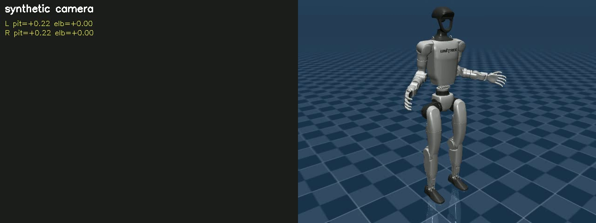

# Real2Sim — Unitree G1 webkamerás vezérlés

Felsőtest-utánzó "real2sim" rendszer: a laptop webkamerája figyeli az operátor
mozgását, és a karok pózát (váll pitch / roll / yaw + könyök) átültetjük egy
Unitree G1 humanoid modellre MuJoCo-ban valós időben. A demó videó osztott
képernyőn mutatja a kamerát (skeleton overlay-jel) és a szimulációt.

A SZTAKI ERM 2026 tervezési feladata. Licensz: **CC0 1.0 Universal**.



## Architektúra

```
Webkamera → MediaPipe Pose (Tasks API) → 8-D ízületi szögvektor (retarget)
                                                  │
                                          exp. simítás (α=0.4)
                                                  │
                              MuJoCo G1 (8 position aktuátor, torzo rögzítve)
                                                  │
                          osztott képernyős mp4 (kamera | sim) — opcionális
```

- **Computer vision**: Google MediaPipe Pose (Tasks API). 33 testpont,
  hip-centered méter-skálás 3D koordináták. CPU-n fut, ~30 ms / frame.
- **Fizika**: MuJoCo 3.8 + `mujoco_menagerie/unitree_g1` MJCF.
- **Vezérlés**: 4 DoF / kar (váll pitch + roll + yaw, könyök).
- **OpenClaw integráció**: a pipeline egy openclaw skill-ként is elérhető
  (`openclaw/skills/real2sim/`), ami subprocess-ként indítja-leállítja.

## Telepítés (Windows, bash / Git Bash)

```bash
# 1. Klónozás
git clone https://github.com/Electric-Racing-Miskolc/TT_2026_SZTAKI_ERM.git
cd TT_2026_SZTAKI_ERM

# 2. Submodule-ok / külső repo-k
#   - mujoco_menagerie  (Unitree G1 MJCF)
#   - openclaw          (skill orchestrátor)
# Ha nem submodule-ként vannak, klónozd külön:
#   git clone https://github.com/google-deepmind/mujoco_menagerie.git
#   git clone https://github.com/openclaw/openclaw.git

# 3. Python venv
python -m venv real2sim_env
source real2sim_env/Scripts/activate    # Windows
# source real2sim_env/bin/activate       # Linux/macOS

# 4. Dep-ek
pip install -r requirements.txt

# 5. MediaPipe pose modell (~9 MB)
mkdir -p models
curl -L -o models/pose_landmarker_full.task \
  https://storage.googleapis.com/mediapipe-models/pose_landmarker/pose_landmarker_full/float16/latest/pose_landmarker_full.task
```

## Használat

```bash
# Csak kamera + skeleton overlay (gyors hardver-ellenőrzés)
python scripts/run_real2sim.py --pose-only

# Élő szimuláció + viewer (a karok valós időben követik a felhasználót)
python scripts/run_real2sim.py --viewer

# Demo mp4 felvétele 20 másodpercig (offscreen render, split-screen)
python scripts/run_real2sim.py --record demo.mp4 --duration 20

# Debug: 30 frame-enként kiírja az aktuális ízületi szögeket
python scripts/run_real2sim.py --viewer --debug
```

### CLI kapcsolók

| Flag | Leírás |
|------|--------|
| `--pose-only` | Kamera + póz overlay; nincs MuJoCo |
| `--viewer` | Élő MuJoCo viewer + kamera ablak |
| `--record PATH` | Split-screen mp4 írása |
| `--duration N` | N másodperc után megáll (0 = `q`-ig) |
| `--camera IDX` | Kamera index (default 0) |
| `--no-mirror` | Ne tükrözze a kamera képet a megjelenítéskor |
| `--debug` | Periodikus szög-printek |

### OpenClaw skill

```bash
python openclaw/skills/real2sim/scripts/run.py --action status
python openclaw/skills/real2sim/scripts/run.py --action start
python openclaw/skills/real2sim/scripts/run.py --action stop
python openclaw/skills/real2sim/scripts/run.py --action record --out demo.mp4 --duration 20
```

A skill manifest leírása: [openclaw/skills/real2sim/SKILL.md](openclaw/skills/real2sim/SKILL.md).

## Tesztelés

```bash
# Retarget matematika unit tesztek
python -m pytest tests/test_retarget.py -v

# End-to-end szintetikus pipeline (kamera nélkül, mp4-et ír)
python tests/smoke_pipeline_synth.py

# Kamera-diagnosztika (engedélyek + index)
python tests/camera_diag.py

# Pose modell live tesztje (kamera szükséges)
python tests/smoke_pose.py
```

## Projekt szerkezet

```
real2sim/                     fő csomag
├── config.py                 konstansok (joint nevek, FPS, modell útvonal)
├── pose.py                   MediaPipe Tasks wrapper
├── retarget.py               landmark → 8 ízületi szög (numpy-only)
├── filter.py                 exponenciális simítás
├── sim.py                    MuJoCo G1 wrapper, torzo rögzítés
├── recorder.py               cv2.VideoWriter split-screen
└── runner.py                 fő ciklus (capture → pose → ctrl → step → render)

scripts/
└── run_real2sim.py           CLI

openclaw/skills/real2sim/
├── SKILL.md                  openclaw skill manifest
└── scripts/run.py            start / stop / status / record orchestrátor

tests/
├── test_retarget.py          unit tesztek 6 szintetikus pózra
├── smoke_pose.py             webkamera live póz teszt
├── smoke_pipeline_synth.py   end-to-end mp4 kamera nélkül
└── camera_diag.py            kamera index és engedély-diagnosztika

mujoco_menagerie/             külső, BSD-3 (Google DeepMind)
openclaw/                     külső, MIT
```

## Pose → ízület leképezés

A `retarget.py` egy testkeretet épít vállak + csípők alapján
(`e_x`=alany bal, `e_z`=gerinc fel, `e_y`=mellkasból kifelé). Minden karra:

```
shoulder_pitch = atan2(uy, -uz)               # uy/uz = felkar y/z testkeretben
shoulder_roll  = asin(±ux)                    # + bal, − jobb
shoulder_yaw   = atan2(f_pr.x, f_pr.y)        # alkar a pitch+roll utáni keretben
elbow          = acos(dot(unit_upper, unit_forearm))
```

A jobb karon az `ux` előjelét és a `yaw` előjelét fordítjuk, hogy a G1
aszimmetrikus joint range-eivel egyezzen (lásd `tests/test_retarget.py`).

## Licensz

Ez a repo **CC0 1.0 Universal** licenszű (lásd [LICENSE](LICENSE)). Külső
komponensek a saját licenszüket örzik:

- [mujoco_menagerie](mujoco_menagerie/LICENSE) — Apache 2.0
- [unitree_g1 MJCF](mujoco_menagerie/unitree_g1/LICENSE) — BSD-3
- [openclaw](openclaw/LICENSE) — MIT
- [MediaPipe](https://github.com/google-ai-edge/mediapipe) — Apache 2.0
